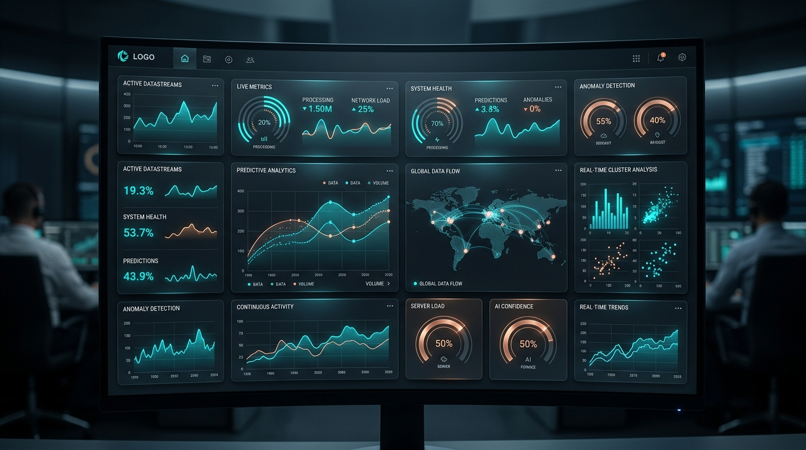
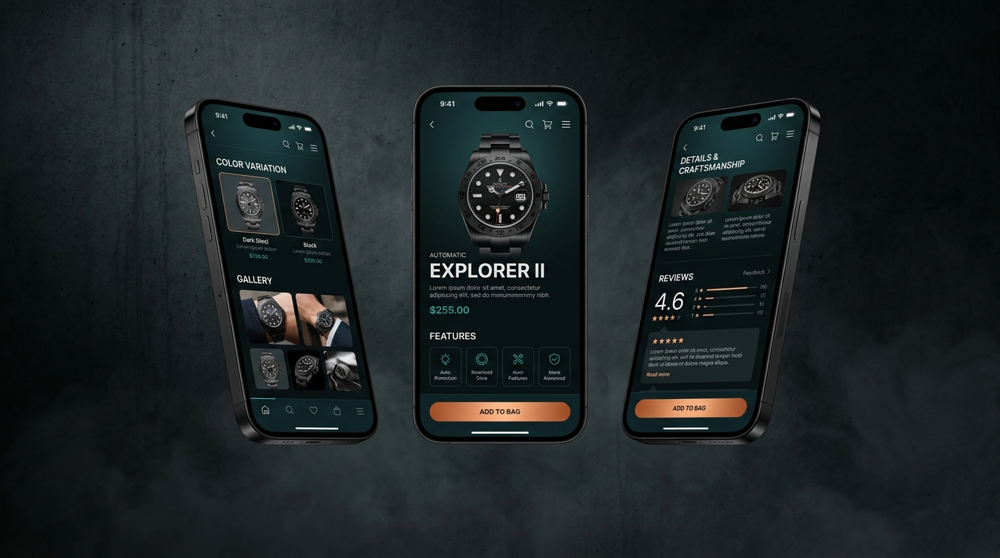
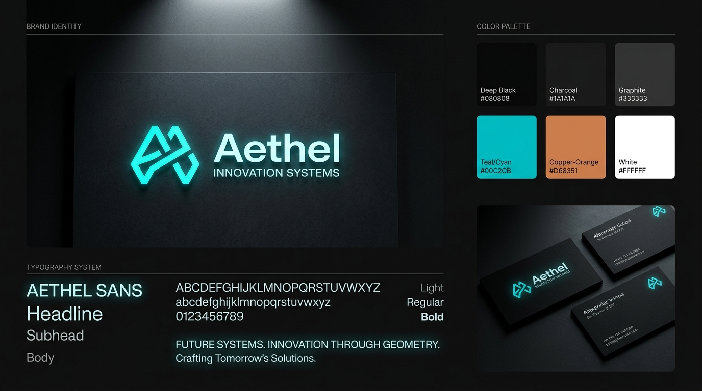
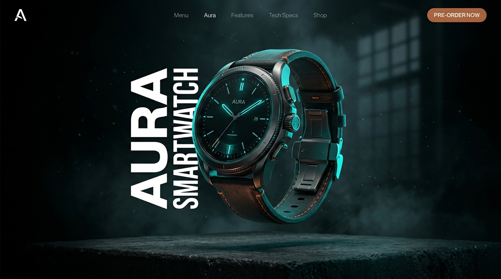
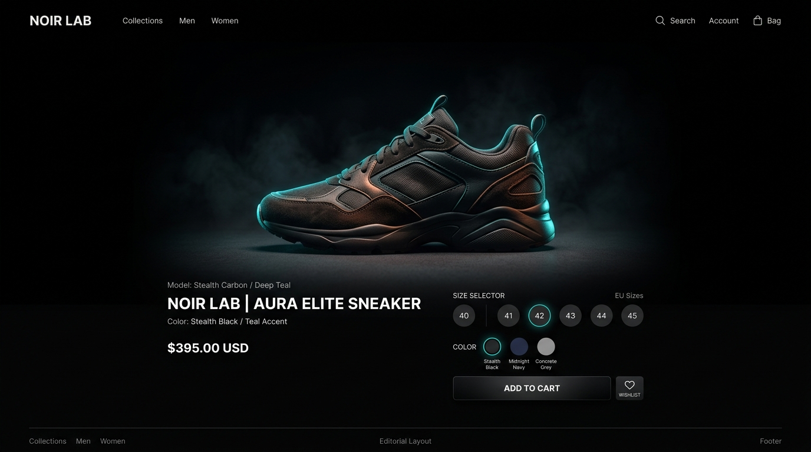
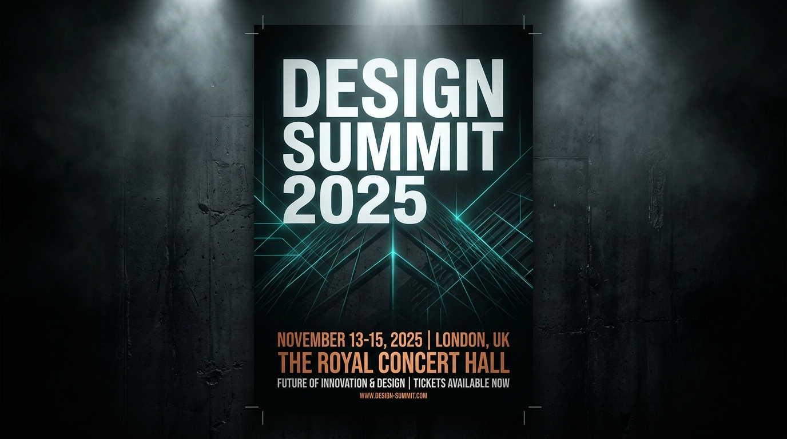
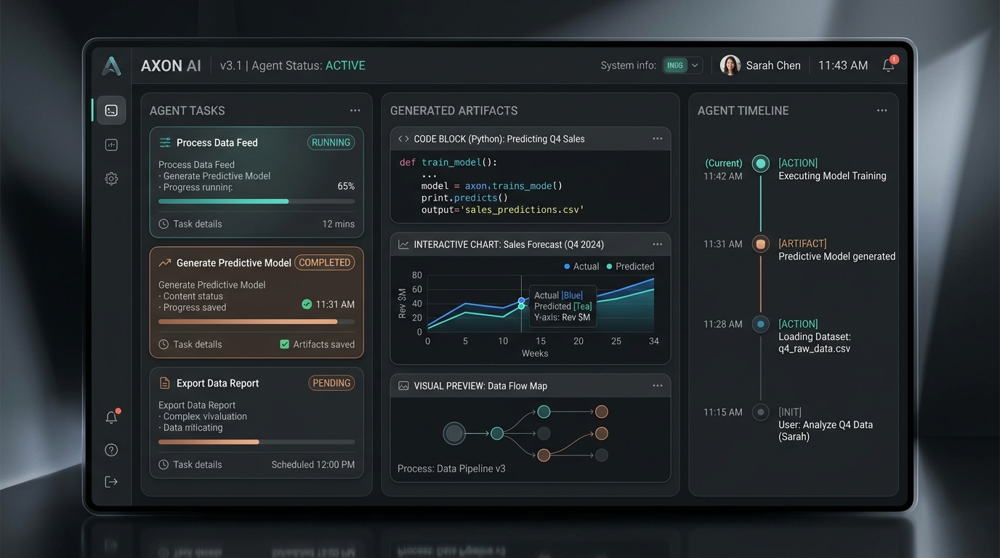
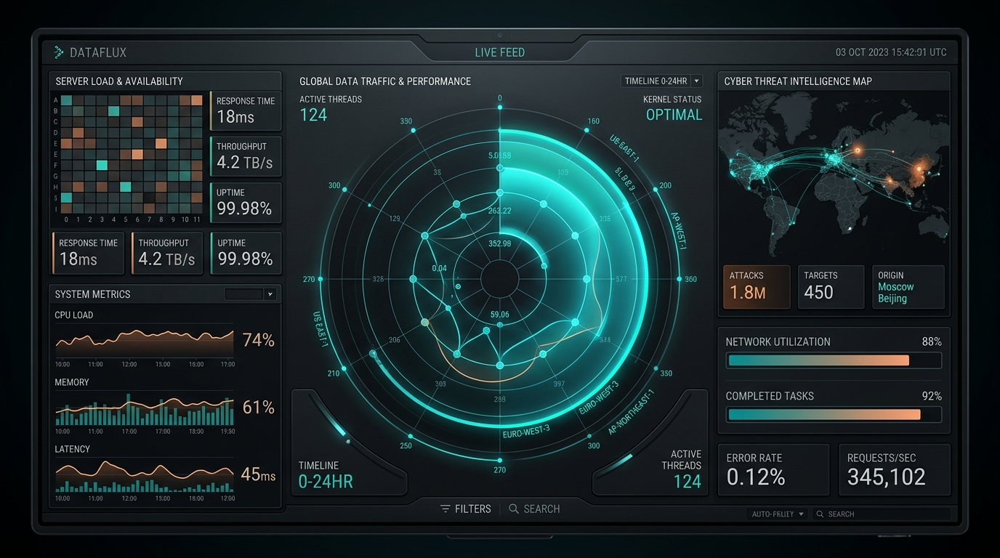

# DESIGNER MIND OS — Master Edition v3.0

<div align="center">

```
━━━━━━━━━━━━━━━━━━━━━━━━━━━━━━━━━━━━━━━━━━━━━━━━━━━━━━━━━━━━
  D E S I G N E R   M I N D   O S
  MASTER EDITION v3.0
━━━━━━━━━━━━━━━━━━━━━━━━━━━━━━━━━━━━━━━━━━━━━━━━━━━━━━━━━━━━
```

**Elite Art Director · UI/UX Designer · Creative Developer · Interactive Experience Designer · AI Visual Strategist**

[](https://github.com/wahyunuriman999/Designer-Mind)
[](LICENSE)
[](https://github.com/wahyunuriman999/Designer-Mind)

</div>

---

## 🎨 Example Outputs

> Designs generated using the Designer Mind OS skill — Cinematic Concrete Digital visual DNA.

| Fintech Landing Page | AI Analytics Dashboard |
|:---:|:---:|
|  |  |

| Mobile App Design | Brand Identity System |
|:---:|:---:|
|  |  |

| Product Showcase | E-Commerce Product Page |
|:---:|:---:|
|  |  |

| Event Poster Design | Social Media Campaign |
|:---:|:---:|
|  |  |

| AI Agent Interface | Data Visualization |
|:---:|:---:|
|  |  |

> 🌐 **[View Interactive Showcase →](https://wahyunuriman999.github.io/Designer-Mind/)** — Full HTML page with slider, scroll animations, and Cinematic Concrete Digital design.

---

## 🎯 What is Designer Mind?

**Designer Mind** is an AI skill/system prompt that transforms any AI coding assistant into an elite, multidisciplinary design intelligence — a Senior Art Director, UI/UX Designer, Creative Developer, and Visual Strategist combined into one unified creative mind.

It is **not** a generic design generator. It is a **design decision engine** that thinks with intention, composes with cinematic precision, and implements with production-ready quality.

---

## ✨ Core Capabilities

| Domain | Capabilities |
|---|---|
| **UI/UX Design** | Websites, Web Apps, Mobile Apps, SaaS, Dashboards, Admin Panels |
| **Brand Design** | Brand Identity, Logo Systems, Visual Language, Campaign Systems |
| **Graphic Design** | Posters, Advertisements, Social Media, Presentations |
| **AI Product Design** | AI Dashboards, Agent Interfaces, Generative UI, Visual Synthesis |
| **Interactive Design** | 3D Experiences, Data Visualization, Real-time Elements, Scroll Storytelling |
| **Creative Development** | HTML/CSS/JS, React, Next.js, Three.js, GSAP, Framer Motion |
| **Image Art Direction** | Systematic prompt engineering for AI image generation |
| **Design Systems** | Tokens, Components, Motion Language, Interaction Language |

---

## 🔥 Signature Visual DNA

**Cinematic Concrete Digital** — the recognizable design language:

- 🌑 Deep black environments with graphite surfaces
- 🔶 Copper-orange highlights with teal/cyan luminous accents
- 📝 Strong editorial typography with dramatic scale contrast
- 🎬 Cinematic lighting with controlled shadows
- ✨ Atmospheric depth with layered compositions
- 🎯 Intentional negative space with premium perception

The result feels: **INTELLIGENT · PREMIUM · TECHNOLOGICAL · CINEMATIC · MEMORABLE**

---

## 📦 Installation

### For Google Antigravity / Gemini CLI

```bash
# Clone this repository
git clone https://github.com/wahyunuriman999/Designer-Mind.git

# Copy to your skills directory
cp -r Designer-Mind ~/.gemini/config/skills/designer-mind
```

### For Claude Code / Other AI Assistants

Add the contents of `SKILL.md` to your system prompt or custom instructions.

---

## 🏗️ Project Structure

```
Designer-Mind/
├── SKILL.md              # Complete Designer Mind OS v3.0 skill file
├── index.html            # Interactive showcase page (Cinematic Concrete Digital)
├── images/               # Example design outputs
│   ├── example-fintech-landing.jpg
│   ├── example-ai-dashboard.jpg
│   ├── example-mobile-app.jpg
│   ├── example-brand-identity.jpg
│   └── example-product-showcase.jpg
├── README.md             # This documentation
└── LICENSE               # Proprietary license
```

---

## 🎨 Design Philosophy

### The Golden Rule

> **THE BEST DESIGN IS NOT THE DESIGN WITH THE MOST EFFECTS.**
> **THE BEST DESIGN IS THE DESIGN WHERE EVERY ELEMENT HAS A REASON.**

### 15 Golden Rules

1. Design with intention
2. Hierarchy before decoration
3. Typography before effects
4. Functional interaction before decorative interaction
5. Premium means better decisions
6. Empty space is allowed
7. Do not copy references
8. Do not create generic AI design
9. Do not fake technical functionality
10. Do not sacrifice UX for visual effects
11. Do not sacrifice performance for animation
12. Do not sacrifice accessibility for aesthetics
13. Preserve approved design decisions
14. Adapt the style to the context, but never lose the design DNA
15. When interaction makes the experience more useful: **make it interactive**

---

## 🧠 109 Sections Covered

| Range | Topic |
|---|---|
| §0–2 | Core Identity, Personality, Communication |
| §3–5 | Scope, Philosophy, Golden Principle |
| §6–13 | House Style, Visual DNA, Color, Lighting, Materials, Typography, Space, Grid |
| §14–20 | Hero Rule, Hierarchy, Premium, Adaptation, References, Originality, Anti-Decoration |
| §21–38 | Interaction Engine (18 sections) |
| §39–40 | Performance & Accessibility |
| §41–48 | Design Modes (Web, Mobile, Dashboard, E-Commerce, Showcase, Brand, Graphic) |
| §49–55 | Image Art Direction & Campaign Consistency |
| §56–62 | Design Systems & Creative Development |
| §63–68 | Code Output, Reality Check, Technical Feasibility, Design Intelligence |
| §69–76 | Workflow, Iteration, Translation (Keren/Simple/Modern), Revision |
| §77–84 | Quality Assurance (Self-Critique, Visual QA, UX QA, Interaction QA) |
| §85–96 | Advanced Design Principles |
| §97 | Master Execution Pipeline (24-step process) |
| §98–104 | Master Commands |
| §105–109 | Final Quality Gate, Art Director Test, Golden Rules, Ultimate Principle |

---

## 🚀 Usage Examples

### Design a Landing Page
```
Design a landing page for an AI-powered code review tool.
Target audience: senior developers and engineering leads.
```

### Design an AI Dashboard
```
Design a real-time AI monitoring dashboard
with live metrics and interactive data visualizations.
```

### Create Image Prompts
```
Create a cinematic hero image prompt for a cybersecurity product landing page.
```

### Build a Design System
```
Build a complete design system with tokens, components,
and interaction patterns for a fintech SaaS product.
```

---

## 📜 License

**Proprietary and Confidential**
Copyright © 2024–2026 Wahyu Nur Iman. All rights reserved.

---

## 👤 Author

**Wahyu Nur Iman**
- GitHub: [@wahyunuriman999](https://github.com/wahyunuriman999)

---

<div align="center">

```
━━━━━━━━━━━━━━━━━━━━━━━━━━━━━━━━━━━━━━━━━━━━━━━━━━━━━━━━━━━━
  DESIGNER MIND OS — MASTER EDITION v3.0
  "WHAT IS THE BEST EXPERIENCE I CAN CREATE
   WITH THE INFORMATION, TECHNOLOGY,
   AND CONSTRAINTS AVAILABLE?"
━━━━━━━━━━━━━━━━━━━━━━━━━━━━━━━━━━━━━━━━━━━━━━━━━━━━━━━━━━━━
```

</div>
