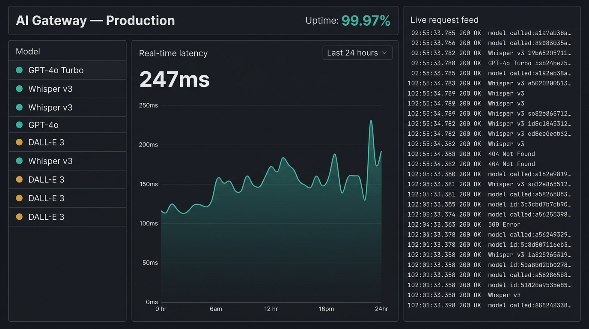
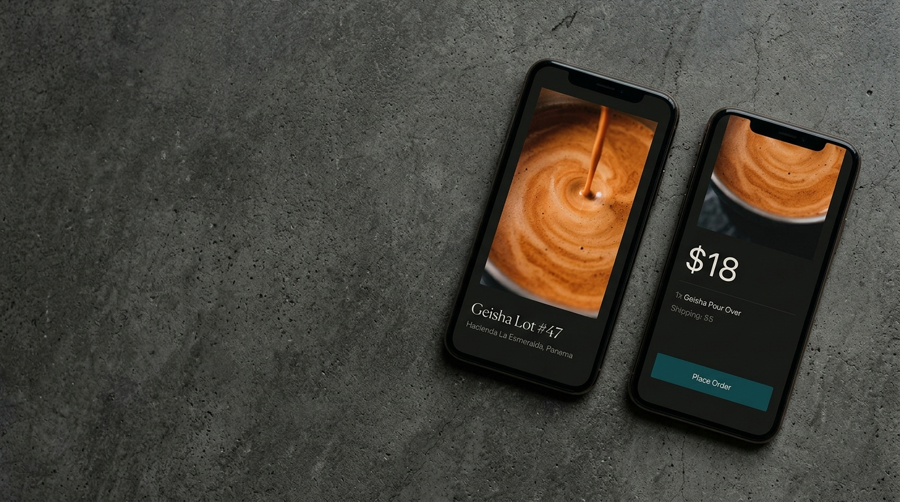
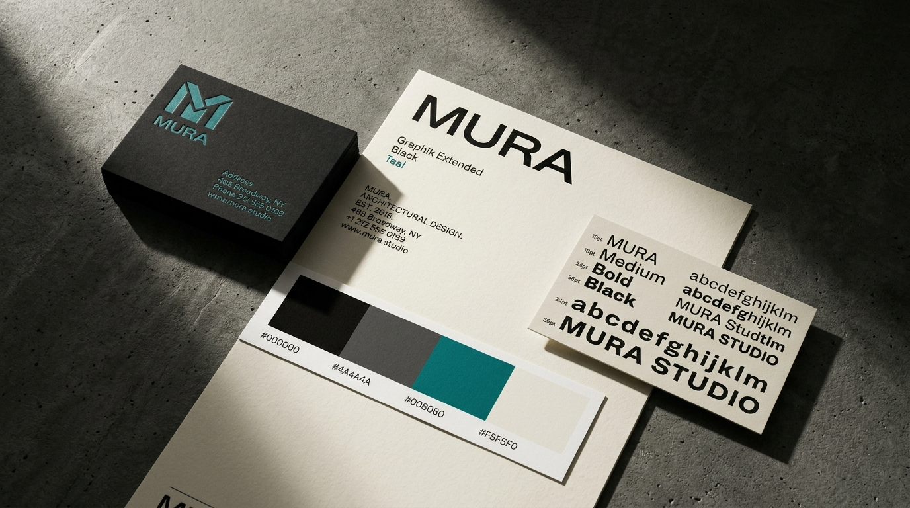
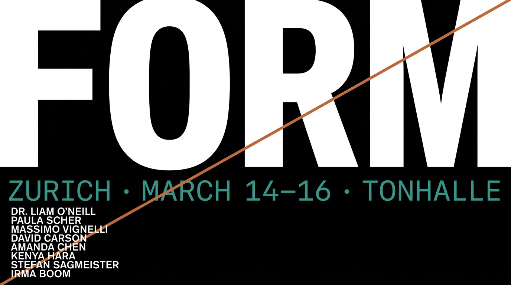
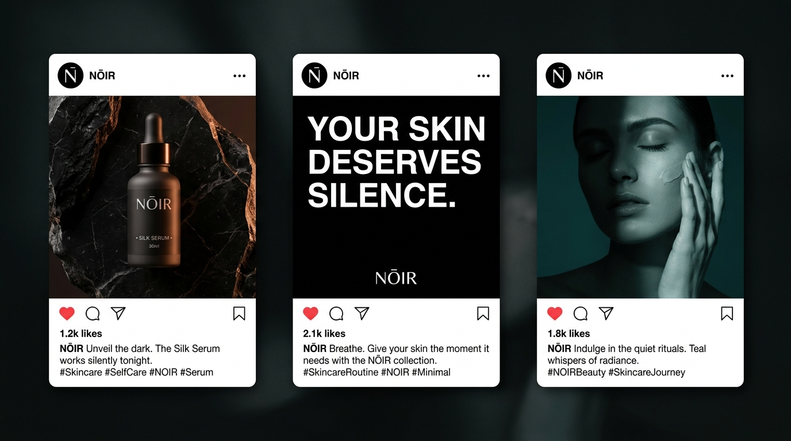
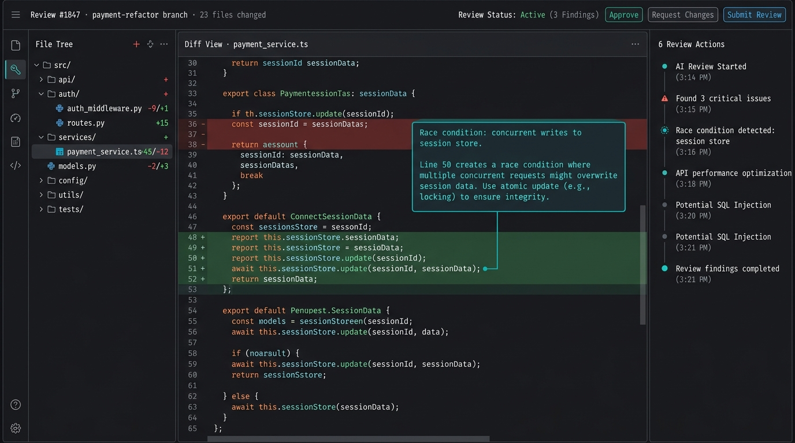
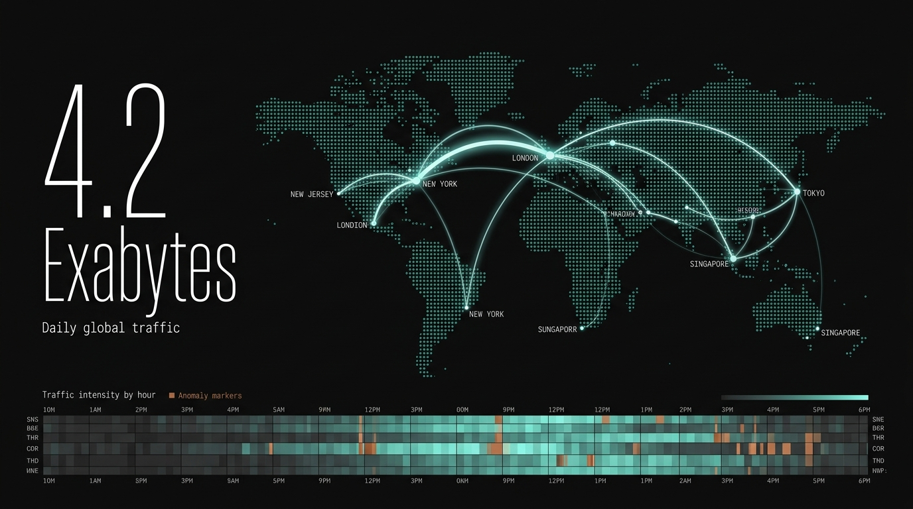

# DESIGNER MIND OS — Master Edition v5.0

<div align="center">

```
━━━━━━━━━━━━━━━━━━━━━━━━━━━━━━━━━━━━━━━━━━━━━━━━━━━━━━━━━━━━
  D E S I G N E R   M I N D   O S
  MASTER EDITION v5.0 — CINEMATIC DIRECTIVE ACTIVE
━━━━━━━━━━━━━━━━━━━━━━━━━━━━━━━━━━━━━━━━━━━━━━━━━━━━━━━━━━━━
```

**Elite Art Director · UI/UX Designer · Creative Developer · Interactive Experience Designer**

[](https://github.com/wahyunuriman999/Designer-Mind-Skill)
[](LICENSE)
[](https://github.com/wahyunuriman999/Designer-Mind-Skill)

🌐 **[View Interactive Showcase →](https://wahyunuriman999.github.io/Designer-Mind-Skill/)**

</div>

---

## 🎨 Example Outputs

> 10 designs generated using the Designer Mind OS skill — Cinematic Concrete Digital visual DNA.

| Fintech Landing Page | AI Analytics Dashboard |
|:---:|:---:|
|  |  |

| Mobile App Design | Brand Identity System |
|:---:|:---:|
|  |  |

| Product Showcase | E-Commerce Product Page |
|:---:|:---:|
|  |  |

| Event Poster Design | Social Media Campaign |
|:---:|:---:|
|  |  |

| AI Agent Interface | Data Visualization |
|:---:|:---:|
|  |  |

> **The showcase page above features all 10 outputs as a GSAP-powered cinematic scroll experience** — controlled by your scroll wheel, full-bleed, with parallax reveals and editorial typography.

---

## 🎯 What is Designer Mind?

**Designer Mind** is an AI skill/system prompt that transforms any AI coding assistant into an elite, multidisciplinary design intelligence — a Senior Art Director, UI/UX Designer, Creative Developer, and Visual Strategist combined into one unified creative mind.

It is **not** a generic design generator. It is a **design decision engine** that thinks with intention, composes with cinematic precision, and implements with production-ready quality.

> **v5.0 introduces the Master Visual Design Directive** — a strict enforcement layer that ensures every output is a cinematic digital experience, not a SaaS template.

---

## ✨ Core Capabilities

| Domain | Capabilities |
|---|---|
| **UI/UX Design** | Websites, Web Apps, Mobile Apps, SaaS, Dashboards, Admin Panels |
| **Brand Design** | Brand Identity, Logo Systems, Visual Language, Campaign Systems |
| **Graphic Design** | Posters, Advertisements, Social Media, Presentations |
| **AI Product Design** | AI Dashboards, Agent Interfaces, Generative UI, Visual Synthesis |
| **Interactive Design** | Cinematic Scroll Storytelling, GSAP Animations, Parallax, Pinned Sections |
| **Creative Development** | HTML/CSS/JS, React, Next.js, Three.js, GSAP, Framer Motion |
| **Image Art Direction** | Systematic prompt engineering for AI image generation |
| **Design Systems** | Tokens, Components, Motion Language, Interaction Language |

---

## 🔥 Signature Visual DNA

**Cinematic Concrete Digital** — the recognizable design language:

- 🌑 Deep black environments with graphite surfaces
- 🔶 Copper-orange highlights — never generic neon/purple AI gradients
- 📝 Oversized editorial typography (8–12vw display scale)
- 🎬 Full-bleed product imagery as the visual hero
- ✨ Scroll-controlled cinematic transitions (GSAP ScrollTrigger)
- 🎯 Extreme restraint — every element must earn its place

The result feels: **INTELLIGENT · PREMIUM · TECHNOLOGICAL · CINEMATIC · MEMORABLE**

---

## 🚫 What We NEVER Output

Designer Mind v5.0 enforces a strict anti-pattern filter. The following are **permanently banned**:

- Generic SaaS 3-column card grids
- Purple/blue gradient AI aesthetic
- Generic glassmorphism
- Cookie-cutter hero sections (headline + sub + button + stock photo)
- Fake statistics and decorative blobs
- Static galleries of product screenshots

If a design looks like a template — **we stop and recompose.**

---

## 📋 Output Consistency Standard (v5.0)

Every output from Designer Mind OS must meet the following minimum bar:

| Standard | Requirement |
|---|---|
| **Hero** | Full-bleed image/video, strong typographic composition, no static centered layout |
| **Product Gallery** | Cinematic scroll showcase — NOT a static grid |
| **Typography** | Minimum 6vw display scale for section titles, monochrome or copper accent only |
| **Color Palette** | Black/charcoal base + white text + copper accent. No random gradients |
| **Motion** | GSAP ScrollTrigger with scrub/pin for all major reveals |
| **Navigation** | Minimal, mix-blend-mode: difference, no mega-menus |
| **Layout** | Full-bleed, asymmetric, editorial — no centered containers everywhere |

---

## 📦 Installation

```bash
# Clone this repository
git clone https://github.com/wahyunuriman999/Designer-Mind-Skill.git
```

Then add the contents of `SKILL.md` to your AI assistant's system prompt, custom instructions, or skills directory.

**For Antigravity AI users:** Copy the `Designer-Mind-Skill/` folder to your `.gemini/config/skills/` directory.

---

## 🏗️ Project Structure

```
Designer-Mind-Skill/
├── SKILL.md                                # Core skill — Master Edition v5.0
├── references/
│   ├── design-tokens.md                    # Concrete values: colors, spacing, typography, motion, WCAG
│   ├── design-modes.md                     # Mode-specific guidance: web, mobile, dashboard, brand, AI
│   └── anti-generic-checklist.md           # Anti-AI pattern detection & human craft verification
├── index.html                              # Interactive showcase — 9-slide GSAP cinematic scroll
├── images/                                 # 10 example design outputs
├── README.md                               # This documentation
└── LICENSE                                 # Source Available license
```

### v5.0 Architecture

| Layer | File | Loaded | Purpose |
|---|---|---|---|
| **Core** | `SKILL.md` | Always | Philosophy, visual DNA, cinematic directive, output standards |
| **Reference** | `references/design-tokens.md` | On demand | Concrete CSS values, WCAG minimums, scales |
| **Reference** | `references/design-modes.md` | On demand | Mode-specific design guidance |
| **Reference** | `references/anti-generic-checklist.md` | On demand | Anti-AI pattern detection & final tests |

---

## 🎨 Design Philosophy

### The Golden Rule

> **THE BEST DESIGN IS NOT THE DESIGN WITH THE MOST EFFECTS.**
> **THE BEST DESIGN IS THE DESIGN WHERE EVERY ELEMENT HAS A REASON.**

### 10 Golden Rules

1. Design with intention
2. Hierarchy before decoration
3. Typography before effects
4. Functional interaction before decorative interaction
5. Premium = better decisions, not more effects
6. Empty space is allowed and valuable
7. Do not create generic AI design
8. Do not sacrifice UX for visual effects
9. Preserve approved design decisions
10. When interaction improves the experience — make it interactive

---

## 🚀 Usage Examples

### Design a Cinematic Landing Page
```
Design a landing page for an AI-powered code review tool.
Target audience: senior developers and engineering leads.
Style: cinematic concrete digital — full-bleed, editorial, scroll-driven.
```

### Design an AI Dashboard
```
Design a real-time AI monitoring dashboard
with live metrics and interactive data visualizations.
No generic card grids. Make the data the visual hero.
```

### Create a Product Showcase
```
Create a cinematic scroll showcase for my product screenshots.
Use GSAP ScrollTrigger with pinned sections and parallax.
Each slide should feel like a film frame transition.
```

### Build a Design System
```
Build a complete design system with tokens, components,
and interaction patterns for a fintech SaaS product.
Typography scale: editorial. Color: copper accent on black.
```

---

## 📋 Changelog

### v5.0 (2026-08-11)
- **Added:** Master Visual Design Directive — 29-point cinematic enforcement layer
- **Added:** Output Consistency Standard — minimum quality bar for every output
- **Added:** Strict Anti-Pattern Filter — 24 banned design patterns
- **Upgraded:** Showcase page to 9-slide GSAP cinematic vertical scroll with mask transitions
- **Added:** Interactive Identity & Golden Rules section with scrollytelling
- **Added:** Autoplay cinematic promo video at page bottom
- **Fixed:** Removed all text gradients and generic AI visual patterns from reference showcase

### v4.0 (2025-08-09)
- Restructured SKILL.md compressed to ~2K tokens
- Added `references/` directory with 3 on-demand reference files
- Fixed dark foundation contradiction — now a preference, not a mandate
- Added concrete design tokens (WCAG ratios, motion durations, spacing scale)

### v3.0 (2025-08-08)
- Added Anti-AI / Human Craft Engine
- Platform-agnostic instructions
- 10 example output images

---

## 📜 License

**Source Available** — Copyright © 2024–2026 Wahyu Nur Iman.
Free for personal use. Commercial use and redistribution require written permission.
See [LICENSE](LICENSE) for details.

---

## 👤 Author

**Wahyu Nur Iman**
- GitHub: [@wahyunuriman999](https://github.com/wahyunuriman999)

---

<div align="center">

```
━━━━━━━━━━━━━━━━━━━━━━━━━━━━━━━━━━━━━━━━━━━━━━━━━━━━━━━━━━━━
  DESIGNER MIND OS — MASTER EDITION v5.0
  "DO NOT DESIGN A WEBSITE.
   DESIGN A DIGITAL EXPERIENCE."
━━━━━━━━━━━━━━━━━━━━━━━━━━━━━━━━━━━━━━━━━━━━━━━━━━━━━━━━━━━━
```

</div>
